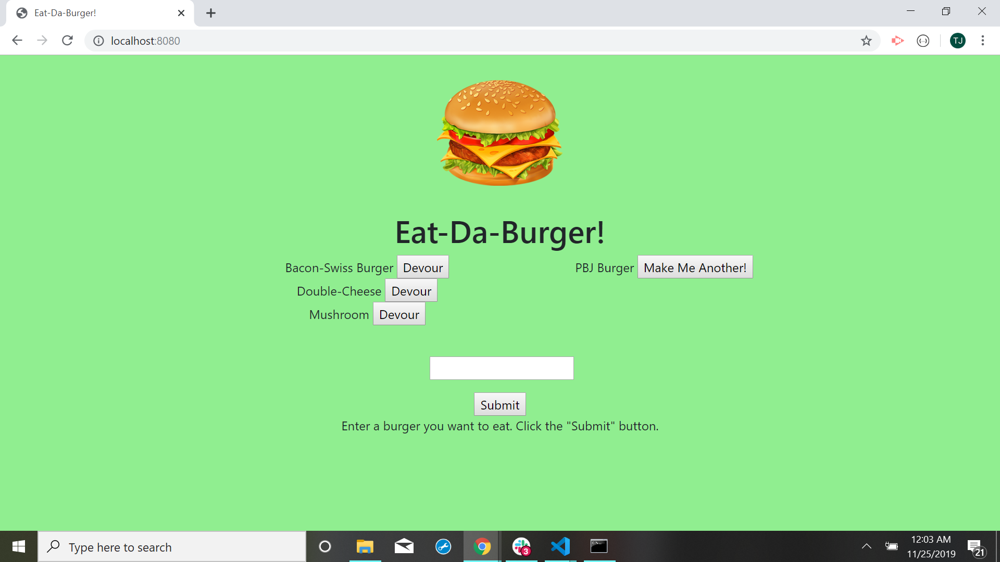

# Burger2

### Description
As a restaurant owner, I wanted an app where users could enter the type of burger they'd like to eat. Once submitted, the burger is displayed on the left of the screen, waiting to be devoured. Once the user designates the burger 'devoured', it is displayed on the right of the screen.

### Technologies-Libraries
Handlebars - ORM - Express.js - Node.js - MySQL - JavaScript

### Screenshots

.png)

### Link
Check it out!
https://tjcheetham.github.io/burger2/.
